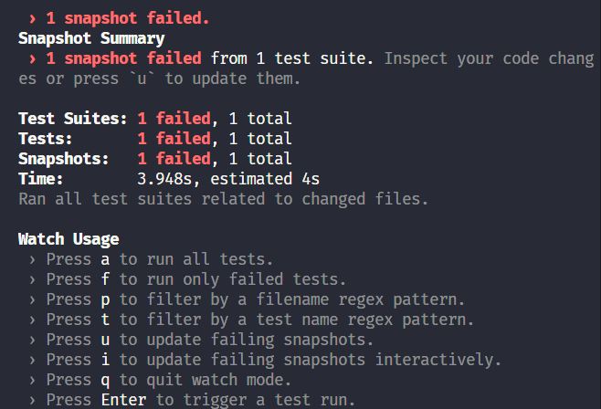
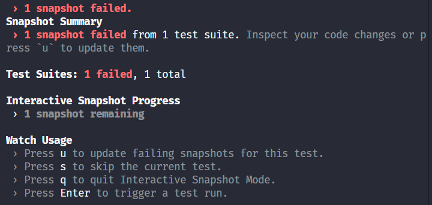
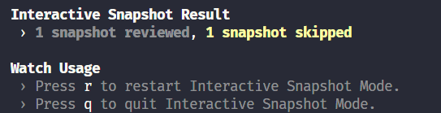
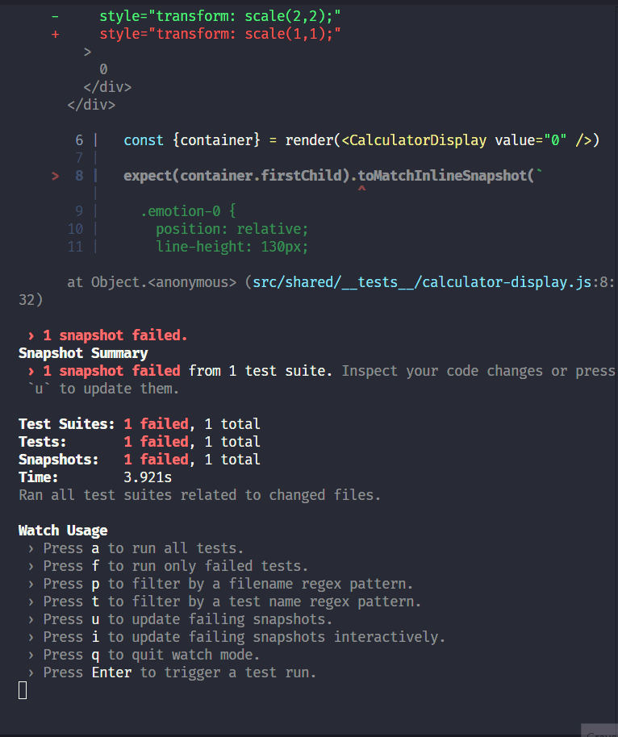
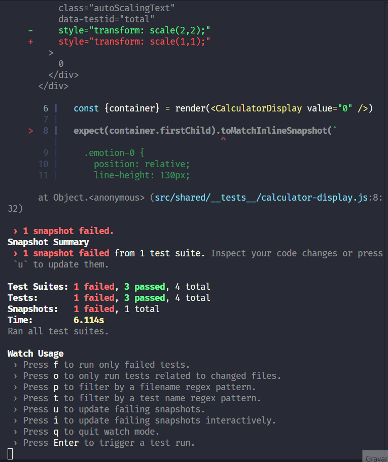

# Notes

## Watch mode

### Watch mode options

Adding a script called test:watch that is going to run jest--watch, we can access Jest watch mode, and Jest will look up and get what files have changed since the last Git commit.

If you're using the snapshot functionality and the failed tests after running the Jest watch mode, you can update your code by pressing the `u` key.

And we can take a look at the other options by pressing the `w` key to show more, and then, by pressing one of the keys in the list, you can focus on specific tests you want to take a closer look at.

  

After choosing one of the options, other options can be available, and you can continue do navigate by pressing the key related to them.

For example, the image options below will be displayed after pressing the `i` key after running the Jest watch mode and having a snapshot failed test.

  

Still, in the above example, the `s` key is pressed to skip, and that will give a summary of what happened during this interactive snapshot session, and pressing the `q` key (in the example), all the tests will run again.

  

We can use the options to check specific tests, for example, all failed tests by pressing the `f` key, making it a log of easier to focus on particular issues and debug faster.

Other handful functionality is the ability of filter by a filename regex pattern and/or by a test name regex pattern.

After filtering by a regex pattern (filename and/or test name), pressing the `w` key it'll be possible to see that there is an active filter applied that can be removed by pressing `c`.

  

  

Every time we need to re-run the tests for any reason, we can press `Enter`, and we can press `q` to quit the watch mode.

While the tests are running, we can press any other key to interrupt the tests.
